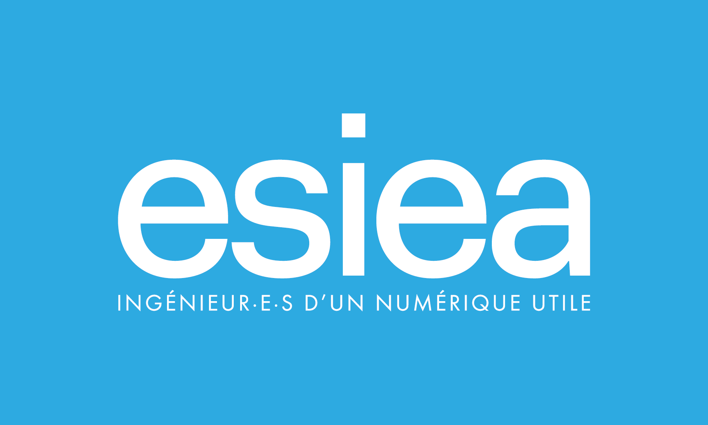

<div align="center">

# Milano 2026: NoSQL Analytics Dashboard
**Technical Guide & Documentation**

 
 
 
 
 


</div>

## Demo


https://github.com/user-attachments/assets/f26d1df0-c75f-4d38-b9db-68bb1854df22
</div>

---

## Overview

This repository contains a full-stack analytics platform designed to analyze social media activity for the **Milano-Cortina 2026 Winter Olympics**. It leverages **MongoDB** for high-volume document storage and **Neo4j** for complex relationship mapping and graph traversal.

---

## Prerequisites

Ensure you have the following installed and running on your local machine:

1.  **Python 3.8+**
2.  **MongoDB Community Server** (Running on port `27017`)
3.  **Neo4j Browser/Desktop** (Running on Bolt port `7687`)

---

## Installation & Setup

### 1. Clone & Environment
Clone this repository and set up a Python virtual environment:

```bash
# Create virtual environment
python -m venv venv

# Activate virtual environment
# On Windows:
venv\Scripts\activate
# On Unix or MacOS:
source venv/bin/activate
```

### 2. Install Dependencies
Install all required libraries for the Flask backend and data processing:

```bash
pip install -r requirements.txt
```

### 3. Configuration
Create a `.env` file in the root directory and configure your database credentials:

```env
MONGO_URI=mongodb://localhost:27017
MONGO_DB_NAME=milano2026
NEO4J_URI=bolt://localhost:7687
NEO4J_USER=neo4j
NEO4J_PASSWORD=your_password
```

---

## Database Initialization (Seeding)

The application requires initial data to populate the charts and relationship graphs.

*   **Automatic Seeding**: Upon running the backend (`api.py`) for the first time, the system will check if MongoDB is empty. If it is, it will automatically generate ~30 users and ~200 tweets using the `SeedService`.
*   **Manual Re-seed**: You can trigger a full database refresh directly from the Dashboard UI using the **"Re-seed"** button in the top navigation bar.

---

## Running the Application

Follow these steps to launch the dashboard:

### Step 1: Start the Backend API
The Flask server handles database connections and executes the NoSQL queries.

```bash
python api.py
```
> [!TIP]
> The API will run at `http://127.0.0.1:5000/api`.

### Step 2: Open the Dashboard
The frontend is built with pure HTML/JS/CSS. Since it's a standalone client:

1.  Locate `dashboard.html` in the root folder.
2.  Open it directly in your web browser (Chrome, Edge, or Firefox recommended).
3.  Ensure the top-right status indicator shows **"Connecté"**.

---

## Project Structure

| File | Description |
| :--- | :--- |
| `api.py` | **Main Entry Point**. Flask REST API exposing all endpoints. |
| `dashboard.html` | The main UI container for the analytics platform. |
| `services_mongo.py` | Business logic for all MongoDB aggregations and CRUD operations. |
| `services_neo4j.py` | Logic for relationship imports and complex Cypher queries. |
| `seed.py` | Data generation engine using the `Faker` library. |
| `config.py` | Environment variable management and global settings. |

---

## Available Functions
*   **KPI Dashboard**: Real-time counters for users, tweets, and trending tags.
*   **Network Graphs**: Interactive visualization of followers, retweets, and conversation threads using `vis-network`.
*   **NoSQL Query Engine**: Dedicated tab to execute 16 specific analytical queries across both database engines.
*   **CRUD Management**: Direct interface to Create, Read, Update, and Delete documents and users.

---
<div align="center">
  <i>Technical Readme - Milano 2026 NoSQL Project</i>
</div>
