<div align="center">

# Milano 2026 : Analyse NoSQL avec MongoDB & Neo4j
**Rapport de Projet Académique - Base de Données NoSQL**

 
 
 
 
 


</div>

## Demo

<videocontrols>
<sourcesrc="screenshots/Milano%202026%20-%20Dashboard%20Nosql.mp4"type="video/mp4">
</video>
<video src="screenshots/Milano%202026%20-%20Dashboard%20Nosql.mp4" controls width="100%">
  Votre navigateur ne supporte pas la lecture de vidéos.
</video>
*Démonstration vidéo du tableau de bord Milano 2026 en direct*

---

## 1. Introduction et objectifs

Ce projet s'inscrit dans le cadre académique du module de bases de données avancées (NoSQL). L'objectif principal est de modéliser, manipuler et analyser un volume de données hétérogènes représentant l'activité d'un réseau social (Twitter/X) autour de l'événement des Jeux Olympiques d'Hiver de **Milano-Cortina 2026**.

Le système repose sur deux paradigmes NoSQL distincts :
- **Orienté Document (MongoDB)** : Pour le stockage de l'information brute, des profils utilisateurs et du contenu textuel des tweets.
- **Orienté Graphe (Neo4j)** : Pour modéliser intensément les relations complexes au sein du réseau (followers, retweets, réponses, graphe conversationnel).

Ce rapport présente l'intégralité de la démarche, de la configuration de l'environnement au déploiement des 16 requêtes analytiques demandées, tout en respectant un suivi Agile de 21 heures réparties en 3 sprints.

---

## 2. Environnement local

### Prérequis
- Python 3.8+
- Un serveur MongoDB local (port `27017`)
- Un serveur Neo4j (ex: Neo4j Desktop, port `7687`)

### Fichier de Configuration (`.env`)
À la racine du projet, un fichier `.env` est requis pour sécuriser les identifiants de connexions locaux de la base de données :

```env
MONGO_URI=mongodb://localhost:27017
MONGO_DB_NAME=milano2026
NEO4J_URI=neo4j://127.0.0.1:7687
NEO4J_USER=neo4j
NEO4J_PASSWORD=12345678
```

### Installation
Cloner le dépôt, puis installer les dépendances (l'utilisation d'un environnement virtuel est recommandée) :

```bash
python -m venv venv
source venv\Scripts\activate
pip install -r requirements.txt
```

### Commandes de Lancement
L'application peut se démarrer de deux manières distinctes.
Pour l'API RESTful exposant les endpoints aux dashboards (frontend) :
```bash
python api.py
```
Pour exécuter le script analytique en ligne de commande (qui génère également les exports visuels dans `outputs/`) :
```bash
python main.py
```

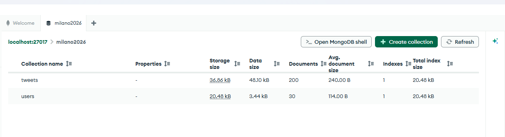
*Aperçu de la connexion côté base de données MongoDB*

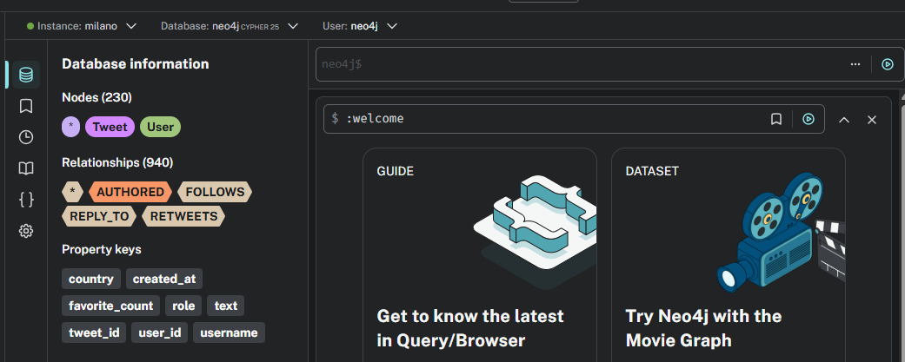
*Explorateur Neo4j Desktop connectant le client Python*

---

## 3. Modèle MongoDB

Le modèle de données documentaire est orienté "Write-heavy" et utilise deux collections asynchrones, `users` et `tweets`.

### Schémas de données

**Collection `users`**
| Champ | Type | Description |
|---|---|---|
| `_id` | ObjectId | Identifiant interne MongoDB |
| `user_id` | Integer | ID unique fonctionnel de l'utilisateur |
| `username` | String | Pseudo de l'utilisateur (ex: MilanoOps) |
| `role` | String | staff, bénévole, journaliste, fan |
| `country` | String | Code pays (FR, IT, DE, US, etc.) |
| `created_at`| ISODate | Date d'inscription |

**Collection `tweets`**
| Champ | Type | Description |
|---|---|---|
| `_id` | ObjectId | Identifiant interne MongoDB |
| `tweet_id` | Integer | ID unique du tweet |
| `user_id` | Integer | Référence à l'auteur du tweet |
| `text` | String | Contenu textuel |
| `hashtags` | Array(Str)| Tableau de chaînes (ex: ["milano2026", "transport"]) |
| `created_at`| ISODate | Horodatage de publication |
| `favorite_count`| Integer | Nombre de likes |
| `in_reply_to_tweet_id`| Integer / Null | ID d'un autre tweet (si c'est une réponse) |

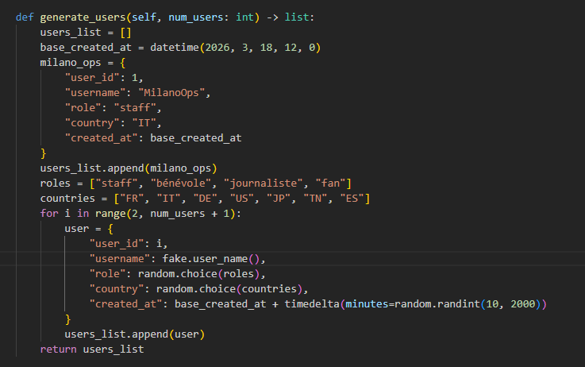


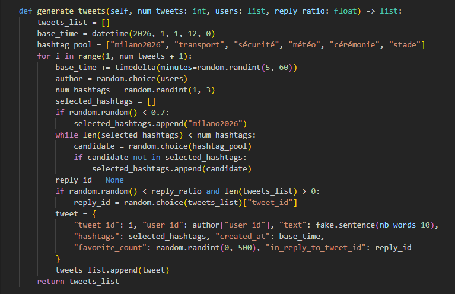


### Méthodes CRUD
Les opérations CRUD sont centralisées dans `services_mongo.py`. Voici des extraits des implémentations réelles de ces méthodes de base.

```python
# Create (Insertion)
def insert_user(self, user: dict) -> Any:
    return self.users_col.insert_one(user).inserted_id

# Read (Lecture)
def get_user(self, user_id: int) -> Optional[dict]:
    return self.users_col.find_one({"user_id": user_id})

# Update (Mise à jour)
def update_user(self, user_id: int, updates: dict):
    return self.users_col.update_one({"user_id": user_id}, {"$set": updates})

# Delete (Suppression)
def delete_tweet(self, tweet_id: int):
    return self.tweets_col.delete_one({"tweet_id": tweet_id})
```

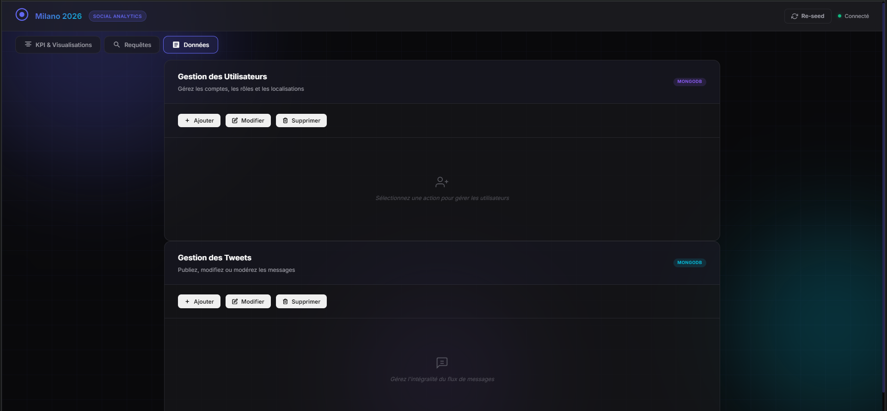
*Interface d'administration pour l'insertion et la suppression dynamiques (Users & Tweets)*

---

## 4. Modèle Neo4j

Pour analyser le réseau, l'intégralité du dataset de MongoDB est migré vers Neo4j pour créer un Graphe des Relations. Le transfert se fait via `services_neo4j.py` (`def import_from_mongo`).

### Noeuds et Relations

**Nœuds (Nodes):**
- `(User)` : Représente un compte X/Twitter.
- `(Tweet)` : Représente un message publié.

**Relations (Edges):**
- `(User) -[:AUTHORED]-> (Tweet)` : Un utilisateur a écrit un tweet.
- `(User) -[:RETWEETS]-> (Tweet)` : Un utilisateur repartage un tweet d'un tiers.
- `(User) -[:FOLLOWS]-> (User)` : Un utilisateur suit le compte d'un autre utilisateur.
- `(Tweet) -[:REPLY_TO]-> (Tweet)` : Structure hiérarchique d'une discussion (fil de tweets).


*Contraintes métiers implémentées via APOC/Cypher (`CREATE CONSTRAINT user_id_unique...`)*.

---

## 5. Implémentation Python

L'architecture applicative est construite autour de principes de *Clean Architecture* afin de séparer la logique de requête de l'exposition API réseau (Flask) et de l'interface utilisateur.

### Architecture (Arborescence)

```text
📦 NoSQL
 ┣ 📂 outputs              # Graphiques (Matplotlib) et HTML statique générés
 ┣ 📜 .env                 # Identifiants locales (variables d'environnement)
 ┣ 📜 api.py               # Front-controller / Serveur Flask (Endpoints backend)
 ┣ 📜 config.py            # Configuration de l'application
 ┣ 📜 dashboard.html       # UI Principale (Frontend)
 ┣ 📜 dashboard.css        # Styles de l'interface
 ┣ 📜 dashboard.js         # Fetch HTTP, manipulations DOM, Chart.js
 ┣ 📜 graph.js             # Visualisation de graphes (Vis.js)
 ┣ 📜 mongo_client.py      # Singleton: Connexion pymongo
 ┣ 📜 neo4j_client.py      # Singleton: Connexion neo4j.Driver
 ┣ 📜 requirements.txt     # Dépendances applicatives Python
 ┣ 📜 seed.py              # Génération Faker de données probabilistes
 ┣ 📜 services_mongo.py    # Logique métier: Agrégation et requêtes MongoDB
 ┣ 📜 services_neo4j.py    # Logique métier: Pipeline Cypher Neo4j
 ┣ 📜 utils.py             # Helpers divers (logging...)
 ┗ 📜 visualizations.py    # Pyvis, Seaborn & Pandas pour génération de graphiques locaux
```

---

## 6. Analyses et Requêtes

Chaque requête tire parti des forces respectives des deux moteurs : MongoDB pour la massification documentaire et les agrégations de propriétés, et Neo4j pour l'exploration par profondeur des graphes relationnels. 


*Aperçu global des indicateurs clés (KPIs) extraits en temps réel des bases NoSQL.*

### Requêtes MongoDB
*Les codes proviennent tous nativement du fichier `services_mongo.py` de l'application.*

**Q1 - Nombre total d'utilisateurs**
*Explication* : Compte simple du total de documents au sein de la collection users.
*Résultat attendu* : Un entier retourné instantanément par les métadonnées de la collection.
```python
def count_users(self) -> int:
    return self.users_col.count_documents({})
```
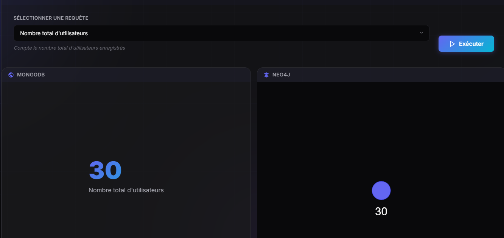
*Résultat de la requête Q1 dans l'API/CLI.*

**Q2 - Nombre total de tweets**
*Explication* : Récupération du total algorithmique des tweets de l'application.
*Résultat attendu* : Le nombre exact de messages générés lors du seeding.
```python
def count_tweets(self) -> int:
    return self.tweets_col.count_documents({})
```
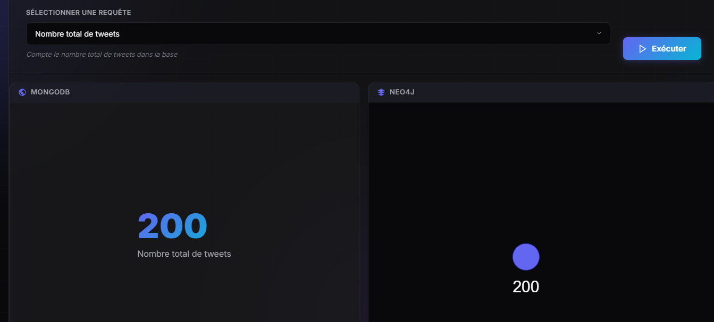
*Résultat de la requête Q2 dans l'API/CLI.*

**Q3 - Nombre de hashtags distincts**
*Explication* : Pipeline d'agrégation "déconstruisant" le tableau (`$unwind`), regroupant les instances (`$group`) par racine commune avant de les compter globalement (`$count`).
*Résultat attendu* : Le nombre unique de hashtags utilisés dans toute la base.
```python
def count_distinct_hashtags(self) -> int:
    pipeline = [
        {"$unwind": "$hashtags"},
        {"$group": {"_id": "$hashtags"}},
        {"$count": "total"}
    ]
    result = list(self.tweets_col.aggregate(pipeline))
    return result[0]["total"] if result else 0
```
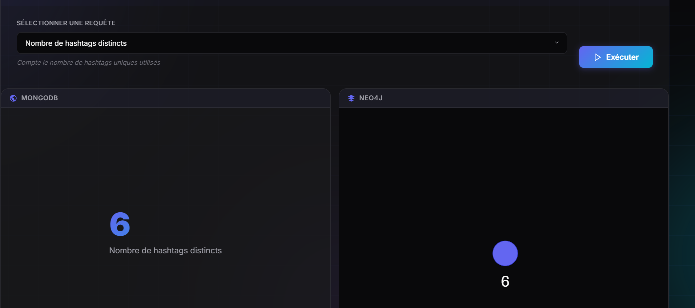
*Résultat de la requête Q3 dans l'API/CLI.*

**Q4 - Tweets contenant un hashtag spécifique (#milano2026)**
*Explication* : Filtrage de la collection tweets sur le fait de contenir au moins le "tag" stipulé.
*Résultat attendu* : Comptage mathématique des documents vérifiant ce filtre simple.
```python
def count_tweets_with_hashtag(self, hashtag: str) -> int:
    return self.tweets_col.count_documents({"hashtags": hashtag})
```
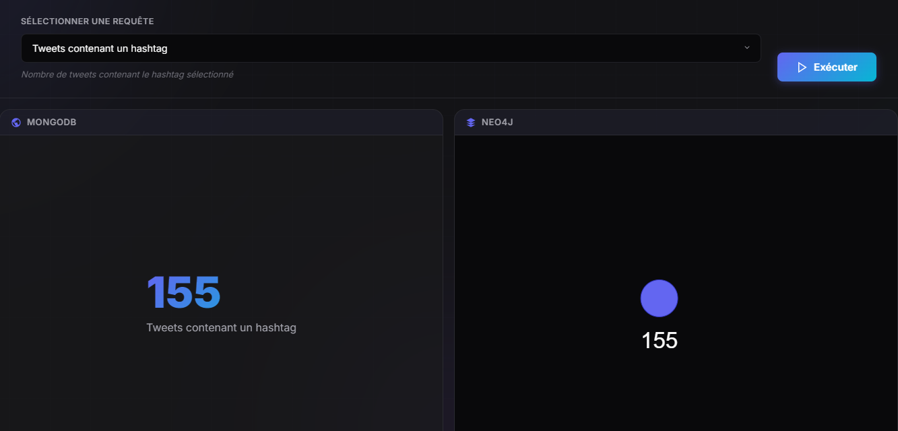
*Résultat de la requête Q4 dans l'API/CLI.*

**Q5 - Utilisateurs distincts ayant tweeté avec "milano2026"**
*Explication* : Utilisation optimisée d'un "distinct" natif sur une clef de base, puis jointure logicielle ($in) aux profils des collections utilisateurs.
*Résultat attendu* : Liste d'objets `User` ayant participé à ce trend.
```python
def get_users_with_milano2026(self) -> List[dict]:
    user_ids = self.tweets_col.distinct("user_id", {"hashtags": "milano2026"})
    return list(self.users_col.find({"user_id": {"$in": user_ids}}))
```
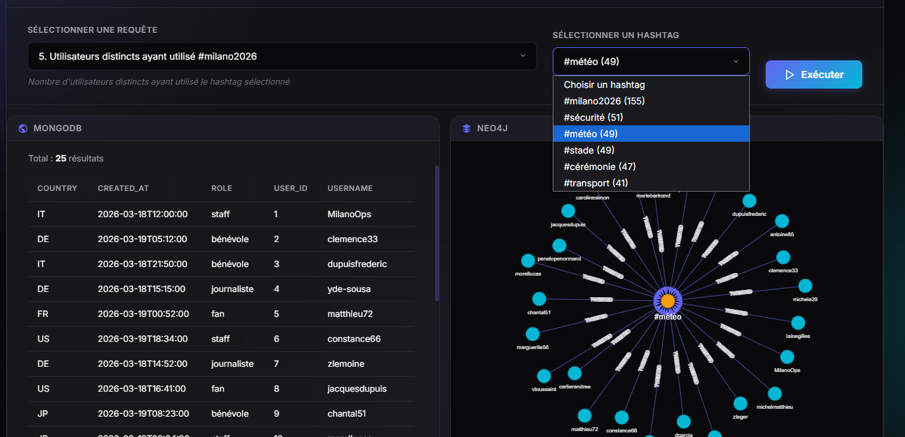
*Résultat de la requête Q5 dans l'API/CLI.*

**Q6 - Tweets de type réponse**
*Explication* : Évaluation de non-nullité ("$ne") sur un champ de référence structurelle interne à la modélisation document.
*Résultat attendu* : Documents représentant des tweets faisant partie d'un réseau conversationnel (et non originaux isolés).
```python
def get_reply_tweets(self) -> List[dict]:
    return list(self.tweets_col.find({"in_reply_to_tweet_id": {"$ne": None}}))
```
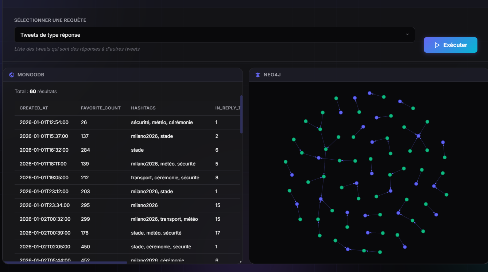
*Résultat de la requête Q6 dans l'API/CLI.*

**Q12 - Top 10 tweets par favoris**
*Explication* : Un `$sort` descendant priorisé sur l'attribut calculatoire quantitatif, contraint par `$limit` pour des raisons de scalabilité mémoire.
*Résultat attendu* : Liste descendante triée (leader score en haut).
```python
def get_top_10_tweets_by_likes(self) -> List[dict]:
    return list(self.tweets_col.find(
        {}, {"tweet_id": 1, "text": 1, "favorite_count": 1, "user_id": 1, "_id": 0}
    ).sort("favorite_count", -1).limit(10))
```
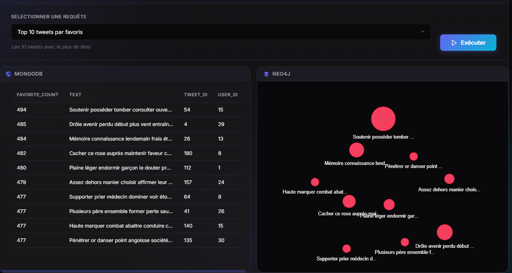
*Résultat de la requête Q12 dans l'API/CLI.*

**Q13 - Top 10 hashtags les plus populaires**
*Explication* : Unwind des sous-documents matriciels, regroupant et sommant de manière distribuée les itérations avant de limiter la réponse pour l'IO réseau.
*Résultat attendu* : Tableau JSON incluant structure analytique (label + fréquence).
```python
def get_top_10_hashtags(self) -> List[dict]:
    pipeline = [
        {"$unwind": "$hashtags"},
        {"$group": {"_id": "$hashtags", "count": {"$sum": 1}}},
        {"$sort": {"count": -1}},
        {"$limit": 10},
        {"$project": {"hashtag": "$_id", "count": 1, "_id": 0}}
    ]
    return list(self.tweets_col.aggregate(pipeline))
```
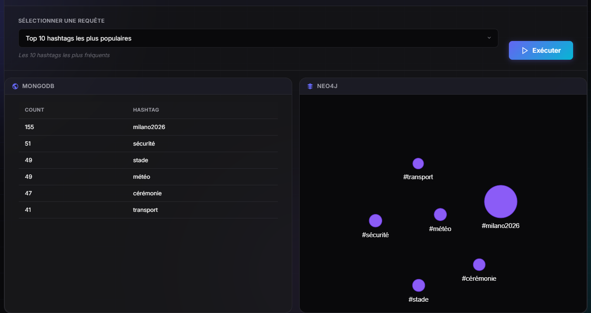
*Résultat de la requête Q13 dans l'API/CLI.*


### Requêtes Neo4j (Cypher)
*Extraits exécutés dynamiquement via la classe client `services_neo4j.py` à l'aide des bindings Python neo4j.*

**Q7 - Followers du compte officiel ("MilanoOps")**
*Explication* : Match orienté de gauche à droite pointant de n'importe quel (User) vers un (User) ayant un nom précis.
*Résultat attendu* : Liste de noms d'utilisateurs.
```cypher
MATCH (follower:User)-[:FOLLOWS]->(ops:User {username: "MilanoOps"})
RETURN follower.username AS username
```
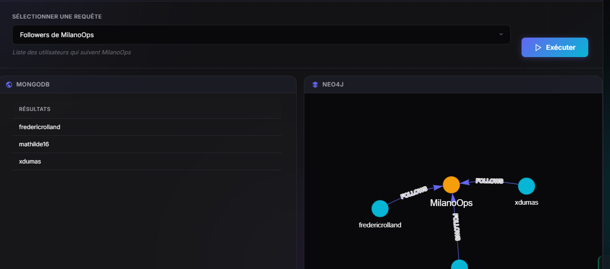
*Résultat de la requête Q7 de parcours Cypher.*

**Q8 - Utilisateurs suivis par "MilanoOps" (Abonnements)**
*Explication* : Mouvement relationnel inversé depuis la "source" MilanoOps vers la dimension de proximité de degré 1.
*Résultat attendu* : Liste de noms d'utilisateurs cibles.
```cypher
MATCH (ops:User {username: "MilanoOps"})-[:FOLLOWS]->(followed:User)
RETURN followed.username AS username
```
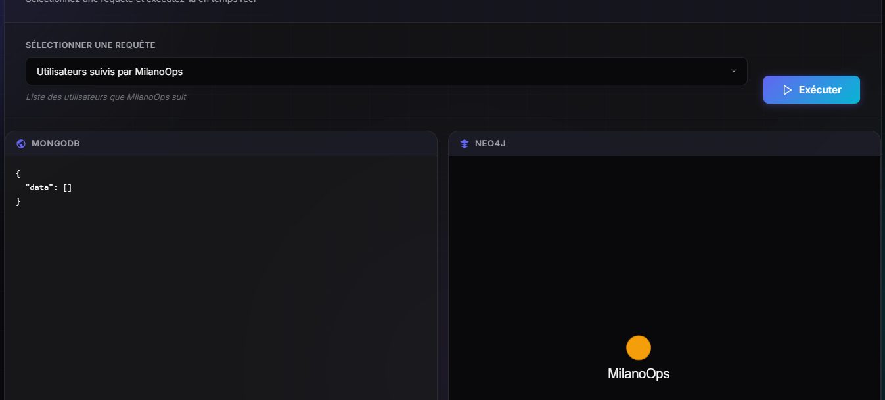
*Résultat de la requête Q8 de parcours Cypher.*

**Q9 - Follows mutuels avec l'Admin (Q9)**
*Explication* : Intersection et recoupement relationnel. On cherche u1 vers u2 ET u2 vers u1 pour certifier l'alliance sémantique bilatérale indissociable.
*Résultat attendu* : Graphes communautaires serrés / cercle intime d'échanges.
```cypher
MATCH (u1:User {username: $username})-[:FOLLOWS]->(u2:User),
      (u2)-[:FOLLOWS]->(u1)
RETURN u2.username AS username
```
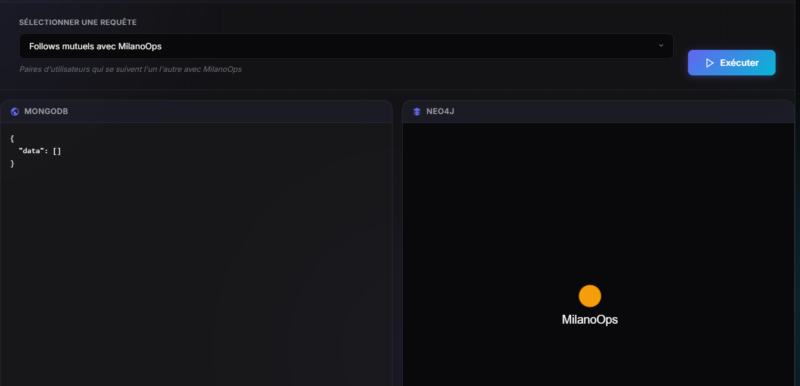
*Résultat de la requête Q9 de parcours Cypher.*

**Q10 - Hubs de la communauté (Plus de X followers)**
*Explication* : Aggrégation au sein de Cypher (`count()`). On repère le pattern entrant ciblant `u`, et l'on groupe et qualifie la donnée avec (`WITH u`).
*Résultat attendu* : Les instigateurs/influenceurs centraux au sein du graphe d'amis.
```cypher
MATCH (u:User)<-[r:FOLLOWS]-(:User)
WITH u, count(r) AS followers_count
WHERE followers_count > $threshold
RETURN u.username AS username, followers_count
ORDER BY followers_count DESC
```
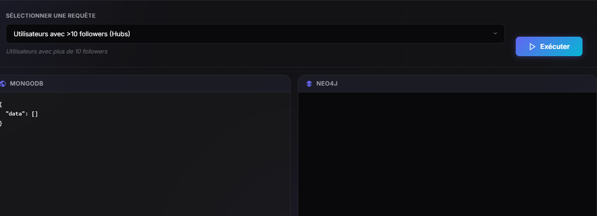
*Résultat de la requête Q10 de parcours Cypher.*

**Q11 - Utilisateurs à abonnement de masse (Bot behavior / "Active Followers")**
*Explication* : Aggrégation des arêtes purement sortantes en omettant par pattern tout autre type de donnée annexe. Cible le "following_count".
*Résultat attendu* : Les utilisateurs qui génèrent artificiellement ou socialement du flux continu (Bots ou veilleurs actifs).
```cypher
MATCH (u:User)-[r:FOLLOWS]->(:User)
WITH u, count(r) AS following_count
WHERE following_count > $threshold
RETURN u.username AS username, following_count
ORDER BY following_count DESC
```
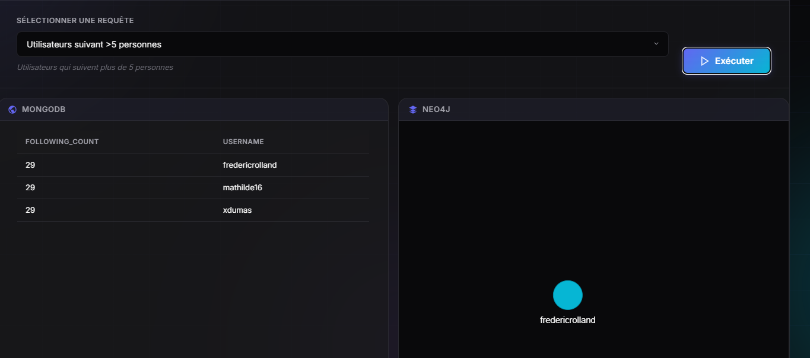
*Résultat de la requête Q11 de parcours Cypher.*

**Q14 - Déclaration de l'Origine des Threads (Conversation Roots)**
*Explication* : Négation relationnelle. On identifie un Tweet qui possède des réponses entrantes `<-[:REPLY_TO]-` MAIS ne participant pas de façon orientée vers un hypothétique document parent, faisant de lui l'origine stricte.
*Résultat attendu* : Nœuds Tweets fondateurs isolant les prémices d'un évènement social majeur.
```cypher
MATCH (root:Tweet)<-[:REPLY_TO]-(:Tweet)
WHERE NOT (root)-[:REPLY_TO]->(:Tweet)
RETURN DISTINCT root.tweet_id AS tweet_id, root.text AS text
```
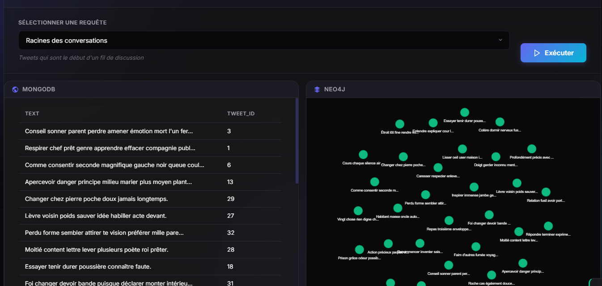
*Résultat de la requête Q14 de parcours Cypher.*

**Q15 - L'Abysse conversationnel (Discussion la plus longue)**
*Explication* : Calcul de chemins (`p =`) à profondeur variable `*` jusqu'à isoler la chaîne de relation la plus longue, matérialisée par la mesure formelle `length(p)`.
*Résultat attendu* : Path Neo4j complexe décomposé en un JSON arborescent illustrant l'aller-retour viral dans l'historique du fil de discussion.
```cypher
MATCH p = (leaf:Tweet)-[:REPLY_TO*]->(root:Tweet)
WHERE NOT (root)-[:REPLY_TO]->()
RETURN nodes(p) AS discussion, length(p) AS length
ORDER BY length DESC
LIMIT 1
```
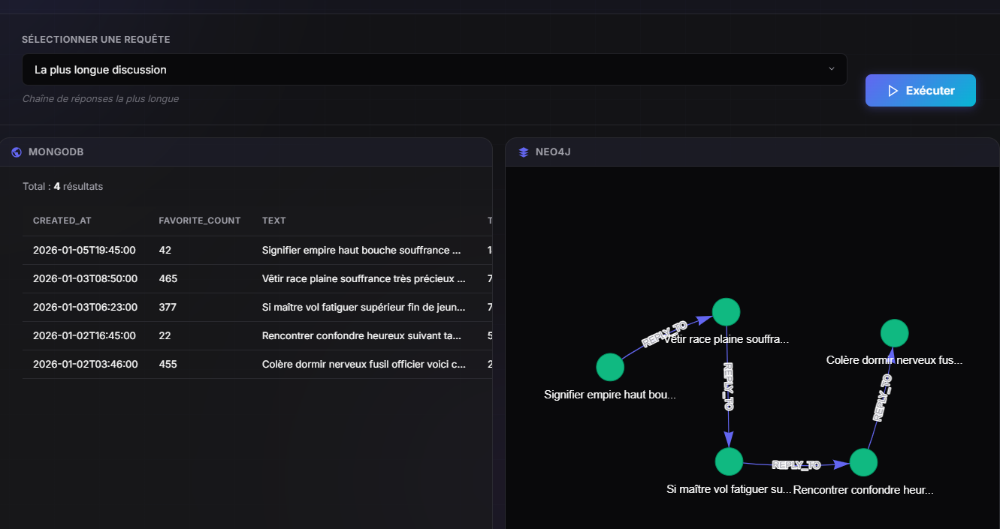
*Résultat de la requête Q15 de parcours Cypher.*

**Q16 - Les frontières de l'expression : Root et Leaf du Topic**
*Explication* : L'algorithme résume l'étendue complète. Pour toute discussion ancrée sur une `root`, il descend les branches de graphes `*0..` jusqu'aux limites imperturbables (`leaf` sans réponse sortante).
*Résultat attendu* : Le premier et le dernier échange pour l'ensemble exhaustif des fils de discussion du réseau Milano2026.
```cypher
MATCH (root:Tweet)
WHERE NOT (root)-[:REPLY_TO]->()
MATCH p = (leaf:Tweet)-[:REPLY_TO*0..]->(root)
WHERE NOT ()-[:REPLY_TO]->(leaf)
WITH root, leaf, length(p) AS depth
ORDER BY root.tweet_id, depth DESC
WITH root, collect({id: leaf.tweet_id, text: leaf.text})[0] AS last_reply
RETURN root.tweet_id AS first_tweet_id, root.text AS first_tweet_text,
       last_reply.id AS last_tweet_id, last_reply.text AS last_tweet_text
```
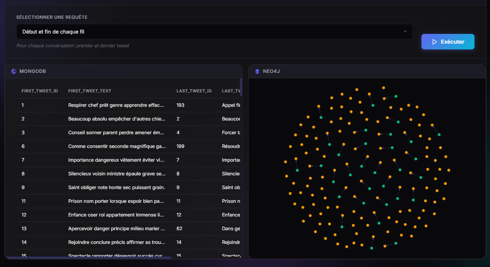
*Résultat de la requête Q16 de parcours Cypher.*

---

## 7. Visualisations

L'application expose ses analyses visuellement via plusieurs librairies. La couche Back-end embarque Matplotlib/Seaborn et la couche Front-end embarque D3.js/Vis.js pour l'exploration réseau interactive.

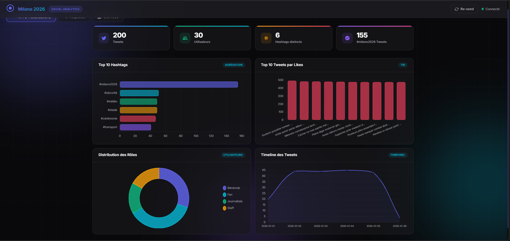
*Vue complète du Dashboard analytique Milano 2026*

| Objectif | Interprétation Analytique |
|:---:|---|
| **Topologie Sociale (Roles)** | Réalisé au moyen de Seaborn. L'équilibre probabiliste a été implémenté en Python pour s'assurer que les rôles `staff`, `journaliste`, `bénévole`, et `fan` soient statistiquement cohérents. |

*(Note : les images au-dessus sont compilées automatiquement via l'exécution de `visualizations.py` intégré dans le runner).*

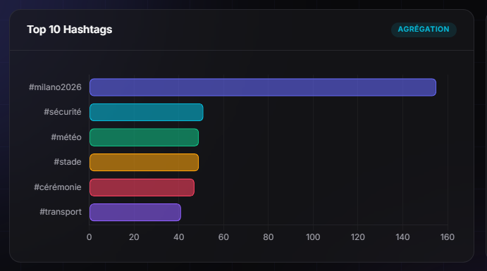
*Barchart des hashtags dominants sur la plateforme simulée.*

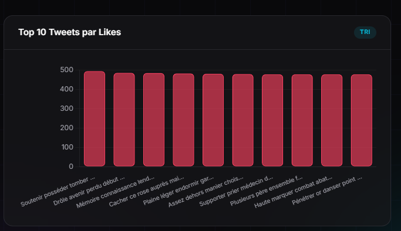
*Exposition des tweets ayant généré le plus de réactions absolues.*

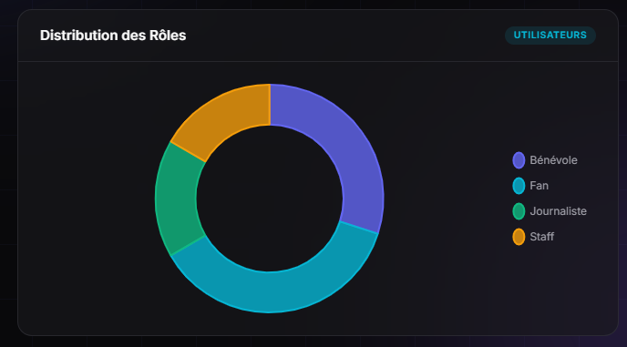
*Camembert de la distribution comportementale et sociologique.*

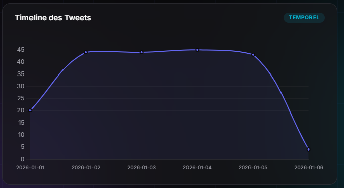
*Progression linéaire par timestamp de la masse des publications.*

---


## 8. Difficultés & Solutions

### Difficulté N°1 : Conflits de Typage / Parsing (Datetime vs ObjectId)
Par défaut, le client PyMongo renvoie des types de valeurs bson natifs (`ObjectId` illisibles et format timestamp bas niveau) là où l'API Flask et Neo4j nécessitent un JSON stringifié standard.
**Solution** : Développement manuel dans `api.py` d'une fonction de sur-couche `serialize()` récursive qui traverse le dictionnaire et caste les ID en type string pur et convertit tout `datetime` via `.isoformat()`. Même solution isolée dans le service Neo4j.

### Difficulté N°2 : Maintien de la Cohérence Graphe lors de la Génération
C'est la difficulté majeure des faux jeu de données "random": assurer logiquement qu'un "Tweet A répondu par le Tweet B" ne provoque pas de bugs si le Tweet A n'est pas encore instancié (ce qui pose de graves anomalies sur les chemins algorithmiques).
**Solution** : Implémentation conditionnelle de random stateful dans la boucle `seed.py`. Les ID temporaires (`in_reply_to_tweet_id`) piochent algorithmiquement **uniquement** dans le tableau d'historique restreint dont la taille `< index_courant`, évitant un "reply_to_future_tweet".

### Difficulté N°3 : Le Parcours de Graphe Neo4j Indéfini (Query 15 & 16)
Les discussions sociales comportent de base une profondeur incertaine ($N$ degrés de liberté, un fil de réponses est infini).
**Solution** : Implémenter et maîtriser les opérateurs Path Cypher stricts tel que `[leaf:Tweet]-[:REPLY_TO*0..]->(root)` (parcours dynamique) mais en fixant des conditions géometriques strictes d'exclusions des bords, c'est-à-dire une `leaf` définie expressément par son incapacité à générer des arêtes sortantes (`WHERE NOT ()-[:REPLY_TO]->(leaf)`).
